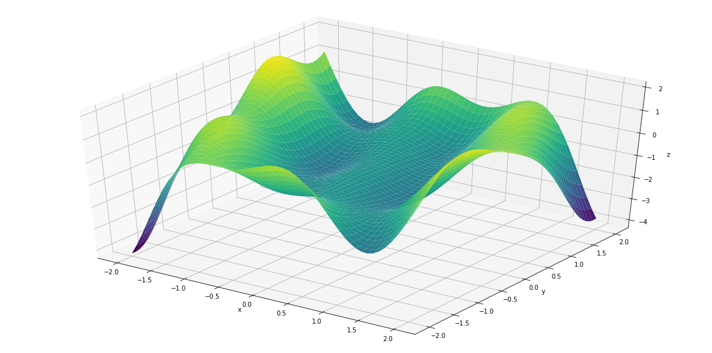

```python
import rbf as q12
import pandas as pd
import numpy as np

                        #please put right path to DATA.csv file in below
data=pd.read_csv(r'path\DATA.csv', sep=',', index_col=None, dtype=np.float64)

q12.rbf(data, n_hidden=100, rho=0.00001,sigma=1.039)   #run_me

```

    C:\Users\admin\Anaconda3\lib\site-packages\h5py\__init__.py:34: FutureWarning: Conversion of the second argument of issubdtype from `float` to `np.floating` is deprecated. In future, it will be treated as `np.float64 == np.dtype(float).type`.
      from ._conv import register_converters as _register_converters
    

    INFO:tensorflow:Optimization terminated with:
      Message: b'STOP: TOTAL NO. of ITERATIONS EXCEEDS LIMIT'
      Objective function value: 0.005732
      Number of iterations: 2001
      Number of functions evaluations: 2119
    
     Nunmber of neurons: 100
    Initial Training Error: 354.6965696497105
    Final Training Error: 0.002345554179635648
    Final Test Error: 0.009988657803955888
    Optimization Solver Chosen: L-BFGS-B
    Norm of Gradient at the optimal point: 0.0016425057888164944
    Time for optimizing the network(sec): 2.6251296997070312
    value of sigma: 1.039
    value of rho: 1e-05
    Approximating function plot: 
    
    





    (None, None, None, None, None, None, None, None, None, None, None)


