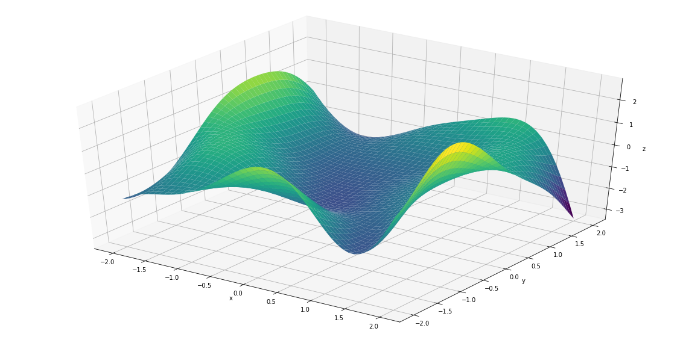

```python
import Functions_21
import numpy as np
import pandas as pd
from sklearn.model_selection import train_test_split

file_name = r'C:\Users\admin\Desktop\data_science\2 year\OMML\project\DATA.csv'
data= pd.read_csv(file_name, sep=',', index_col=None, dtype=np.float64)
xd=np.array(data.iloc[:, :2])
yd=np.array(data.iloc[:, 2])
yd=yd.reshape((200,1))
X_train, X_test, y_train, y_test = train_test_split(xd, yd, test_size=0.25, random_state=200)

n_hidden = 30
rho = 0.00001
lr = 0.13
np.random.seed(36)


z = Functions_21.MLP_EML(X_train, X_test, y_train, y_test, n_hidden, rho, lr)

Functions_21.fun_plot(z)
```

    Number of neurons N:  30
    Initial Training Error:  112.64450589510574
    Final Train Error:  0.11202670097445136
    Final Test Error:  0.11440524240116912
    Optimization solver chosen: AdamOptimizer
    Norm of the gradient at the optimal point:  0.99596775
    Time for optimizing the network: 3 seconds
    value of sigma: 1
    value of rho: 0.00001
    Other hyperparameters:(number of epochs)): 8000
    




