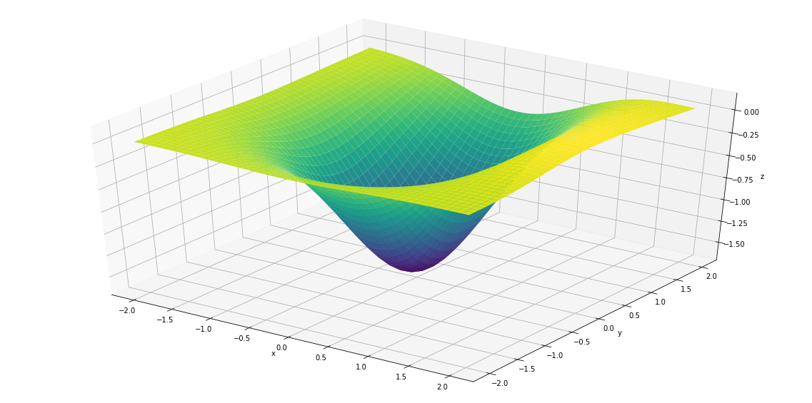

```python

import rbf22 as q22
import pandas as pd
import numpy as np

                        #please put right path to DATA.csv file in below
data=pd.read_csv(r'C:path\DATA.csv', sep=',', index_col=None, dtype=np.float64)

q22.rbf22(data, n_hidden=100, rho=0.00001,sigma=1.039)  #run me
```

    C:\Users\admin\Anaconda3\lib\site-packages\h5py\__init__.py:34: FutureWarning: Conversion of the second argument of issubdtype from `float` to `np.floating` is deprecated. In future, it will be treated as `np.float64 == np.dtype(float).type`.
      from ._conv import register_converters as _register_converters
    

    INFO:tensorflow:Optimization terminated with:
      Message: b'CONVERGENCE: REL_REDUCTION_OF_F_<=_FACTR*EPSMCH'
      Objective function value: 0.325898
      Number of iterations: 11
      Number of functions evaluations: 21
    
     Nunmber of neurons: 100
    Initial Training Error: 211.22520771922086
    Final Training Error: 0.32486910728683654
    Final Test Error: 0.30826058019859565
    Optimization Solver Chosen: L-BFGS-B
    Norm of Gradient at the optimal point: 4.617839858076144e-06
    Time for optimizing the network(sec): 0.23438787460327148
    value of sigma: 1.039
    value of rho: 1e-05
    Approximating function plot: 
    
    





    (None, None, None, None, None, None, None, None, None, None, None)


