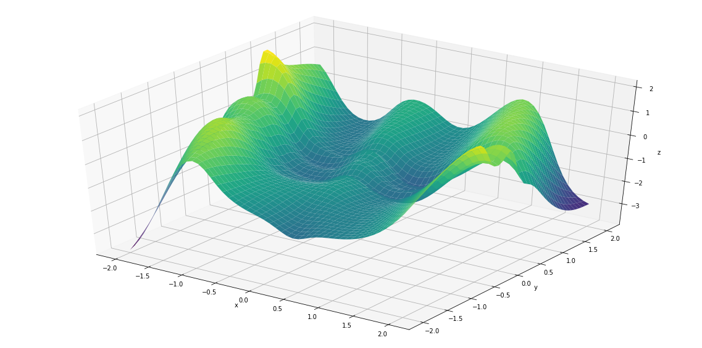

```python
import mlp3
import numpy as np
import pandas as pd

                    # please put right path here
data=pd.read_csv(r'path\DATA.csv', sep=',', index_col=None, dtype=np.float64)

# setting values for hyperparameters
n_hidden = 30
rho = 0.00001
lr = 0.13

# running MLP algorithm
mlp3.MLP(data, n_hidden, rho, lr)


```

    C:\Users\admin\Anaconda3\lib\site-packages\h5py\__init__.py:34: FutureWarning: Conversion of the second argument of issubdtype from `float` to `np.floating` is deprecated. In future, it will be treated as `np.float64 == np.dtype(float).type`.
      from ._conv import register_converters as _register_converters
    

    Number of neurons N:  30
    Initial Training Error:  216.95497688457093
    Final Train Error:  0.0211569580273046
    Final Test Error:  0.03636859309148655
    Optimization solver chosen: AdamOptimizer
    Norm of the gradient at the optimal point:  2.8410811
    Time for optimizing the network: 4 seconds
    value of sigma: 1
    value of rho: 0.00001
    Other hyperparameters:(number of epochs)): 4000
    




